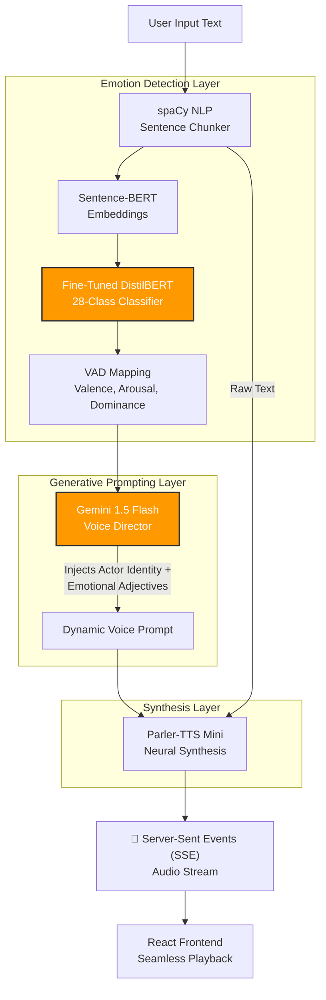

<div align="center">
  <h1>🎙️ KahaaniVani.ai</h1>
  <p><b>Emotion-Aware Neural Text-to-Speech Engine</b></p>
  <p><i>Transforming raw text into emotionally dynamic, highly expressive speech using Fine-Tuned DistilBERT, Gemini 1.5, and Parler-TTS.</i></p>
  
  <p>
    
    
    
    
    
  </p>
</div>

<hr />

## 📖 Overview

Standard Text-to-Speech (TTS) models sound robotic because they lack contextual emotional intelligence. **KahaaniVani.ai** solves this by inserting a multi-stage Machine Learning pipeline *before* speech synthesis. 

It chunks paragraphs, embeds them, predicts their emotional context out of 28 fine-grained emotions, and translates that emotion into a rich Director's Prompt using Gemini 1.5 Flash. This prompt is then fed into Parler-TTS, generating incredibly expressive, cinematic speech that dynamically shifts tone sentence-by-sentence while retaining the exact same voice actor identity.

---

## 🏗️ The Architecture Pipeline



---

## 🧬 Evolution of the Pipeline: Past Approaches vs. Current

Building a contextual TTS engine requires navigating several architectural pitfalls. Throughout the development of KahaaniVani.ai, several approaches were tested and discarded in favor of more robust solutions:

### 1. The Emotion Detection Problem
*   **Past Approach:** Relying entirely on LLMs (like GPT-4 or Gemini) to classify the emotion of the text in zero-shot.
*   **The Flaw:** High latency (often 1-3 seconds just to figure out the emotion) and prohibitive API costs at scale.
*   **Current Approach:** A locally hosted, fine-tuned DistilBERT classifier. It infers the emotion of a sentence in milliseconds (using purely CPU/GPU compute), passing only the final structured VAD coordinates to the LLM for prompt formatting.

### 2. The Voice Continuity Problem
*   **Past Approach (Dynamic Actor Switching):** Initially, the pipeline attempted to "force" emotions out of Parler-TTS by swapping the literal voice actor. For example, sentences tagged with "sadness" were routed to a speaker named *Emily*, while "surprise" was routed to *Joy*.
*   **The Flaw:** Context destruction. A sad sentence followed by a surprised sentence sounded like two completely different people speaking.
*   **Current Approach (Static Actor Anchoring):** We curated 8 fixed Parler-TTS voice actors. The user selects an actor (e.g., *Laura*). The backend locks this identity and forces Gemini to output prompts strictly formatted as: `"{Actor}'s voice is [emotional adjectives]..."`. This guarantees the vocal timbre remains perfectly identical across the entire paragraph, while only their emotional delivery shifts.

### 3. The Prompt Sanitization Problem
*   **Past Approach:** Feeding raw user text directly into Parler-TTS alongside the generated voice description.
*   **The Flaw:** Parler-TTS expects perfectly normalized text. Straight quotes (`'`), smart quotes (`”`), and apostrophes would corrupt the tokenizer's embeddings, resulting in the model generating complete gibberish audio.
*   **Current Approach:** A regex/string sanitization layer sits just before synthesis, stripping un-normalized characters without altering the spoken phonemes.

---

## 🧠 The Machine Learning Process: Rescuing Minority Classes

### The GoEmotions Imbalance
The pipeline relies on the **GoEmotions** dataset, which contains 28 distinct emotion labels. However, this dataset is notoriously imbalanced (e.g., thousands of `surprise` samples, but only 16 `nervousness` samples). 

When evaluating the base `distilbert-base-uncased-emotion` model, it completely failed to recognize these minority classes (scoring 0% F1).

### Aggressive Fine-Tuning
To build a highly sensitive TTS engine, the model needed to recognize subtle emotions. I fine-tuned the model using PyTorch and HuggingFace Transformers with the following strategy:
- **Data Preprocessing**: Sliced the dataset to remove severe multi-label collisions, creating a unified `combined_train.csv`.
- **Data Augmentation**: Weighted sampling to punish the model for missing minority classes.
- **Hyperparameters**: 4 Epochs, aggressive `5e-5` learning rate, and `0.01` weight decay.

### 📊 Model Evaluation Comparison

The fine-tuning yielded a **2.0% absolute increase in Macro F1 Score**. In highly imbalanced datasets, Macro F1 is the true measure of success because it averages the performance of *all* classes equally.

| Metric | Base Model (Before) | Fine-Tuned Model (After) | Change |
| :--- | :--- | :--- | :--- |
| **Accuracy** | 57.6% | 57.5% | -0.1% |
| **Weighted F1** | 56.1% | 56.6% | +0.5% |
| **Macro F1** | 44.0% | **46.0%** | **+2.0%** |

**🎯 Key Minority Class Improvements (F1 Scores):**
The primary goal was to rescue classes that the base model failed to understand. 

| Emotion | Base F1 Score | Fine-Tuned F1 Score | Improvement |
| :--- | :--- | :--- | :--- |
| **Nervousness** | 0.000 | **0.470** | 🚀 (Rescued from zero) |
| **Pride** | 0.164 | **0.233** | +0.069 |
| **Annoyance** | 0.257 | **0.316** | +0.059 |
| **Disappointment** | 0.279 | **0.333** | +0.054 |
| **Disapproval** | 0.360 | **0.390** | +0.030 |

---

## ⚡ Backend Architecture: Asynchronous Streaming

Generating Neural TTS audio takes time (~5-15 seconds per paragraph depending on hardware). If a user pastes a 10-sentence story, waiting 2 minutes for the entire audio file to generate is terrible UX.

**The Solution:** Server-Sent Events (SSE). 
The FastAPI backend uses Python generators (`yield`) to stream the audio data incrementally. As soon as the spaCy chunker finishes processing the *first* sentence, it is sent through the pipeline, synthesized, base64 encoded, and streamed to the React frontend. The user begins listening to sentence 1 while sentence 2 is still generating in the background.

---

## 🛠️ Tech Stack

**Frontend:**
- React (Vite)
- Custom CSS (Glassmorphism, CSS Animations)
- Hot-Toast Notifications

**Backend:**
- Python & FastAPI
- `spaCy` (NLP text segmentation)
- `sentence-transformers` (Sentence embeddings)
- `transformers` & `PyTorch` (DistilBERT Inference & Fine-tuning)
- `parler-tts` (Neural Audio Generation)
- Google Gemini 1.5 API (Prompt Engineering)

---

## 🚀 Getting Started

### 1. Clone & Setup
```bash
git clone https://github.com/rakshit-133/KahaaniVani.ai.git
cd KahaaniVani.ai
```

### 2. Backend (Requires Python 3.10+)
```bash
cd backend
python -m venv venv
source venv/bin/activate  # (or .\venv\Scripts\activate on Windows)
pip install -r requirements.txt

# Create a .env file and add your Gemini API Key
echo "GEMINI_API_KEY=your_api_key_here" > .env

# Run the FastAPI server
uvicorn main:app --host 127.0.0.1 --port 8000
```

### 3. Frontend (Requires Node.js)
```bash
cd frontend
npm install
npm run dev
```
Open your browser to `http://localhost:5173`. Wait for the frontend to automatically ping and connect to the backend, and start generating cinematic audio!
