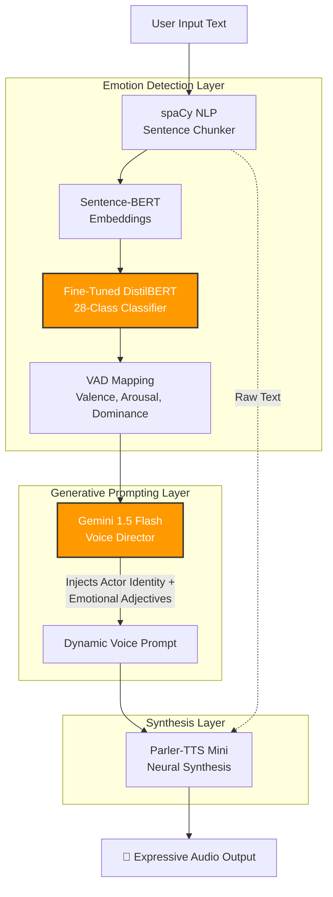

<div align="center">
  <h1>🎙️ KahaaniVani.ai</h1>
  <p><b>Emotion-Aware Neural Text-to-Speech Engine</b></p>
  <p><i>Transforming raw text into emotionally dynamic, highly expressive speech using Fine-Tuned DistilBERT, Gemini 1.5, and Parler-TTS.</i></p>
  
  <p>
    
    
    
    
  </p>
</div>

<hr />

## 📖 Overview

Standard Text-to-Speech (TTS) models sound robotic because they lack contextual emotional intelligence. **KahaaniVani.ai** solves this by inserting a multi-stage Machine Learning pipeline *before* speech synthesis. 

It chunks paragraphs, embeds them, predicts their emotional context out of 28 fine-grained emotions, and translates that emotion into a rich Director's Prompt using Gemini 1.5 Flash. This prompt is then fed into Parler-TTS, generating incredibly expressive, cinematic speech that dynamically shifts tone sentence-by-sentence while retaining the exact same voice actor identity.

---

## 🏗️ The Architecture Pipeline



---

## 🧠 The Machine Learning Process

### 1. Handling the GoEmotions Imbalance
The pipeline relies on the **GoEmotions** dataset, which contains 28 distinct emotion labels. However, this dataset is notoriously imbalanced (e.g., thousands of `surprise` samples, but only 16 `nervousness` samples). The base `distilbert-base-uncased-emotion` model completely failed to recognize these minority classes (0% F1 Score).

### 2. Aggressive Fine-Tuning
To build a highly sensitive TTS engine, the model needed to recognize subtle emotions. I fine-tuned the model using PyTorch and HuggingFace Transformers with the following strategy:
- **Data Augmentation**: Weighted sampling to punish the model for missing minority classes.
- **Hyperparameters**: 4 Epochs, aggressive `5e-5` learning rate, and `0.01` weight decay.

**🏆 The Result:** 
The fine-tuning yielded a **2.0% absolute increase in Macro F1 Score**. It successfully rescued dead minority classes, skyrocketing emotions like `Nervousness` from **0% to 47% F1 Score** and seeing massive bumps in tricky classes like `Pride`, `Annoyance`, and `Disappointment`.

---

## 🗣️ The Voice Continuity Engine

A major challenge with generative TTS models like Parler-TTS is that feeding them different emotional prompts (e.g., "A sad voice" followed by "A surprised voice") causes the model to generate audio that sounds like *two completely different people*.

To solve speaker discontinuity:
1. **Static Actor Anchoring**: I curated 8 fixed Parler-TTS voice actors (e.g., Laura, Jon). 
2. **Dynamic Modification**: Instead of asking the TTS to "be sad", the backend forces Gemini to write a prompt formatted strictly as: `"{Voice_Actor}'s voice is [emotional adjectives based on DistilBERT]..."`
3. **The Outcome**: The voice identity remains 100% locked across multiple paragraphs, while their emotional delivery, pitch, and cadence shift seamlessly from sentence to sentence.

---

## 🛠️ Tech Stack

**Frontend:**
- React (Vite)
- Custom CSS (Glassmorphism, CSS Animations)
- Hot-Toast Notifications

**Backend:**
- Python & FastAPI
- `spaCy` (NLP text segmentation)
- `sentence-transformers` (Sentence embeddings)
- `transformers` & `PyTorch` (DistilBERT Inference & Fine-tuning)
- `parler-tts` (Neural Audio Generation)
- Google Gemini 1.5 API (Prompt Engineering)

---

## 🚀 Getting Started

### 1. Clone & Setup
```bash
git clone https://github.com/rakshit-133/KahaaniVani.ai.git
cd KahaaniVani.ai
```

### 2. Backend (Requires Python 3.10+)
```bash
cd backend
python -m venv venv
source venv/bin/activate  # (or .\venv\Scripts\activate on Windows)
pip install -r requirements.txt

# Create a .env file and add your Gemini API Key
echo "GEMINI_API_KEY=your_api_key_here" > .env

# Run the FastAPI server
uvicorn main:app --host 127.0.0.1 --port 8000
```

### 3. Frontend (Requires Node.js)
```bash
cd frontend
npm install
npm run dev
```
Open your browser to `http://localhost:5173`. Wait for the frontend to automatically ping and connect to the backend, and start generating cinematic audio!
